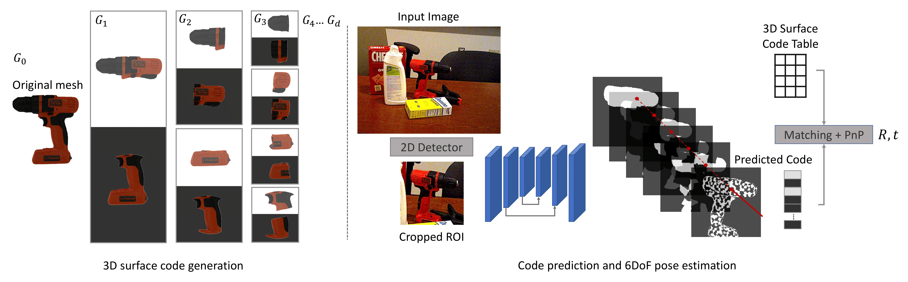

# ZebraPose

The implementation of the paper 'ZebraPose: Coarse to Fine Surface Encoding for 6DoF Object Pose Estimation' (CVPR2022). [`ArXiv`](https://arxiv.org/abs/2203.09418)



## System Requirement
### Tested Environment
- Ubuntu 18.04
- CUDA 11.1
- Python 3.6

### Main Dependencies:
- [`bop_toolkit`](https://github.com/thodan/bop_toolkit)
- Pytorch 1.9
- torchvision 0.10.0
- opencv-python
- [`Progressive-X`](https://github.com/danini/progressive-x)

Download with `git clone --recurse-submodules` so that `bop_toolkit` will also be cloned.

## Training with a dataset in BOP benchmark
### Training data preparation
1. Download the dataset from [`BOP benchmark`](https://bop.felk.cvut.cz/datasets/)

2. Download required ground truth folders of zebrapose from [`owncloud`](https://cloud.dfki.de/owncloud/index.php/s/zT7z7c3e666mJTW). The folders are `models_GT_color`, `XX_GT` (e.g. `train_real_GT` and `test_GT`) and `models` (`models` is optional, only if you want to generate GT from scratch).

3. The expected data structure: 
    ```
    .
    └── BOP ROOT PATH/
        ├── lmo   
        ├── ycbv/
        │   ├── models
        │   ├── models_eval
        │   ├── models_fine
        │   ├── test
        │   ├── train_pbr
        │   ├── train_real
        │   ├── ...               #(other files from BOP page)
        │   ├── models_GT_color   #(from last step)
        │   ├── train_pbr_GT      #(from last step)
        │   ├── train_real_GT     #(from last step)
        │   └── test_GT           #(from last step)
        └── tless
    ```

4. Download the 3 [`pretrained resnet`](https://cloud.dfki.de/owncloud/index.php/s/zT7z7c3e666mJTW), save them under `zebrapose/pretrained_backbone/resnet`. 

5. (Optional) Instead of download the ground truth, you can also generate them from scratch, details in [`Generate_GT.md`](Binary_Code_GT_Generator/Generate_GT.md). 


### Training
Adjust the paths in the config files, and train the network with `train.py`, e.g.

`python train.py --cfg config/config_BOP/lmo/exp_lmo_BOP.txt --obj_name ape`

The script will save the last 3 checkpoints and the best checkpoint, as well as tensorboard log.

## Test with trained model
For most datasets, a specific object occurs only once in a test images. 

`python test.py --cfg config/config_BOP/lmo/exp_lmo_BOP.txt --obj_name ape --ckpt_file path/to/the/best/checkpoint --ignore_bit 0 --eval_output_path path/to/save/the/evaluation/report`

For datasets like tless, the number of a a specific object is unknown in the test stage.

`python test_vivo.py --cfg config/config_BOP/tless/exp_tless_BOP.txt --ckpt_file path/to/the/best/checkpoint --ignore_bit 0 --obj_name obj01 --eval_output_path path/to/save/the/evaluation/report`

Download our trained model from this [`link`](https://cloud.dfki.de/owncloud/index.php/s/EmQDWgd5ipbdw3E)

## Evaluate for BOP challange 
Merge the `.csv` files generated in the last step using `tools_for_BOP/merge_csv.py`, e.g.

`python merge_csv.py --input_dir /dir/to/pose_result_bop/lmo --output_fn zebrapose_lmo-test.csv` 

And then evaluate it according to [`bop_toolkit`](https://github.com/thodan/bop_toolkit)


## Difference between ArXiv v1 and v2
The results were reported with the same checkpoints. We fixed a bug that only influence the inference results: 

The PnP solver requires the Bbox size to calculate the 2D pixel location in the original image. We modified the Bbox size in the dataloader. The bug is that we didn't update this modification for the PnP solver. If you remove the `get_final_Bbox` in the dataloader, you will get the results reported in v1. 

The bug has more influence if we resize the Bbox using `crop_square_resize`. After we fixed the bug, we used `crop_square_resize` for BOP challange (instead of `crop_resize` in the config files in config_paper). We think this resize method should work better since it will not introduce distortion. However, we didn't compare resize methods with experiments.


## Acknowledgement
The original code has been developed together with [`Mahdi Saleh`](https://github.com/mahdi-slh). Some code are adapted from [`Pix2Pose`](https://github.com/kirumang/Pix2Pose), [`SingleShotPose`](https://github.com/microsoft/singleshotpose), [`GDR-Net`](https://github.com/THU-DA-6D-Pose-Group/GDR-Net), and [`Deeplabv3`]().


## Citation
```
@article{su2022zebrapose,
  title={ZebraPose: Coarse to Fine Surface Encoding for 6DoF Object Pose Estimation},
  author={Su, Yongzhi and Saleh, Mahdi and Fetzer, Torben and Rambach, Jason and Navab, Nassir and Busam, Benjamin and Stricker, Didier and Tombari, Federico},
  journal={arXiv preprint arXiv:2203.09418},
  year={2022}
}
```
